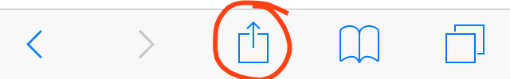
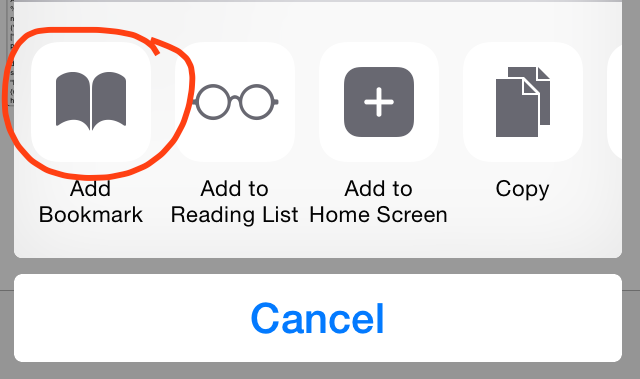
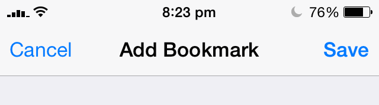
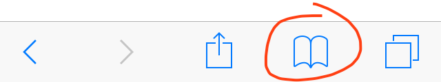
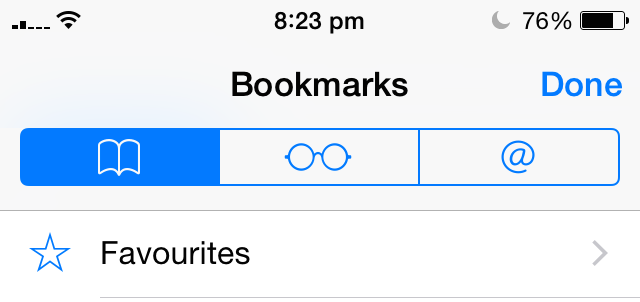
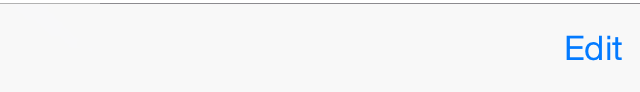
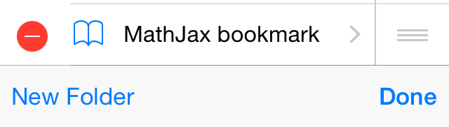
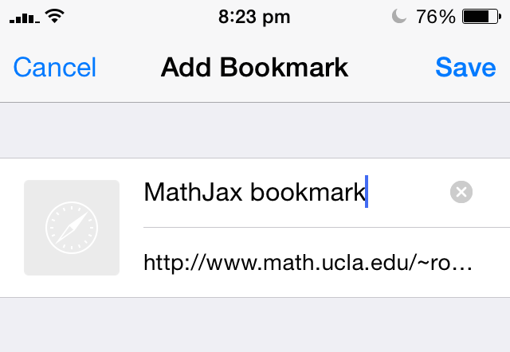

<h1>Youtube Golden Ratio Bookmark</h1>

```
Bookmarklet to get to the Golden Ratio point (0.618) of a YouTube Video
```


Using Safari:


1. Copy the contents of bookmark.js in its entirety to your clipboard on your iOS device
2. Tap the Share button on the toolbar



3. Tap Add Bookmark



4. Tap Save. Ignore whatever content is shown



5. Tap Bookmarks in the toolbar



6. Go back until you reach the root, then tap Favourites



7. Tap Edit on the toolbar



8. Tap the bookmark you've just created



9. Enter a name, erase the contents of the Address field and paste in the bookmarklet



10. Visit any youtube video, tap Bookmarks, then the bookmarklet
